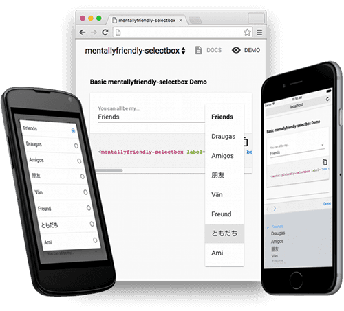

# \<mentallyfriendly-selectbox\>



## A Polymer selectbox with native UI on mobile

This [Polymer](http://www.polymer-project.org/) [web component](https://www.w3.org/TR/components-intro/) works like a [paper-dropdown-menu](https://elements.polymer-project.org/elements/paper-dropdown-menu) on desktop browsers but switches to the native OS select element UI on mobile devices.

Navigating a paper-dropdown-menu with a large number of options can be difficult on small-screen devices, by taking advantage of the native UI we can improve usability for the end-user.

### Usage

1. Import Custom Element:
```html
<link rel="import" href="mentallyfriendly-selectbox/mentallyfriendly-selectbox.html">
```
2. Start using it!
```html
<mentallyfriendly-selectbox
  label="You can all be my..."
  values='["Friends","Draugas","Amigos","朋友","Vän","Freund","ともだち","Ami"]'
></mentallyfriendly-selectbox>
```

## Contributing

Mentally Friendly loves contributions from the community!

### Filing Bugs

If you find an issue, please do file it on the repository.

We love examples for addressing issues - issues with a Plunkr, jsFiddle, or jsBin will be much easier for us to work on quickly. You can start with [this jsbin](https://jsbin.com/xukike/edit?html,output) which sets up the basics to demonstrate a Polymer element.

### Contributing Pull Requests

PR's are even better than issues. We gladly accept community pull requests. In general there are a few necessary steps before we can accept a pull request:

- Open an issue describing the problem that you are looking to solve in your PR (if one is not already open), and your approach to solving it. This makes it easier to have a conversation around the best general approach for solving your problem, outside of the code itself.
- Fork the repo you're making the fix on to your own Github account.
- Code!
- Include tests that test the range of behavior that changes with your PR. If you PR fixes a bug, make sure your tests capture that bug. If your PR adds new behavior, make sure that behavior is fully tested. Every PR must include associated tests.
- Submit your PR, making sure it references the issue you created.
- If your PR fixes a bug, make sure the issue includes clear steps to reproduce the bug so we can test your fix.

If you've completed all of these steps the core team will do its best to respond to the PR as soon as possible.

## Communicating with the Mentally Friendly team

Beyond Github, we try to have a variety of different lines of communication available:

- [Website](http://mentallyfriendly.com)
- [Blog](https://medium.com/@MentallyFriendly)
- [Facebook](https://www.facebook.com/MentallyFriendly)
- [Instagram](https://www.instagram.com/mentallyfriendly)
- [Twitter](https://twitter.com/MF_says)

## License

mentallyfriendly-selectbox uses a BSD license available [here](LICENSE.txt)
